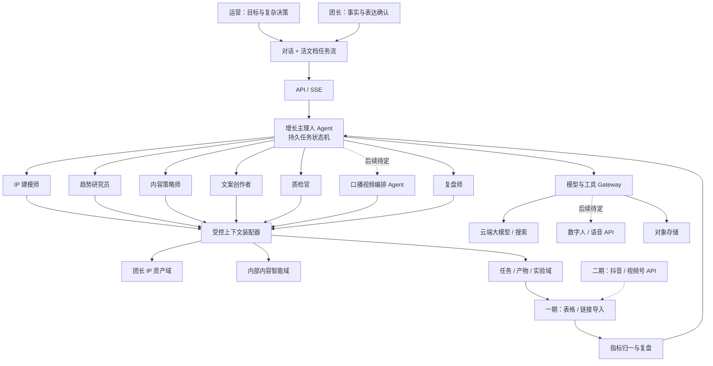

# 团长业务内容增长 Agent 详细设计

**文档状态：** 已完成方案共创，等待书面设计终审

**日期：** 2026-08-15

**首期业务：** 招商内容闭环

**首期交付模式：** 托管服务为主，运营工作台为核心，团长使用轻量协作端

**首期部署：** 单台 4 核 8GB 服务器，可恢复但不承诺高可用

## 1. 执行摘要

本系统服务团长业务的内容增长，不建设通用工作流平台，也不自研精剪、大模型、数字人模型或视频发布平台。核心竞争力集中在四类自有资产：

1. 可验证、可版本化的团长 IP 数字分身；
2. 我方独立运营、对团长不可见的 7 日爆款内容情报库；
3. 面向招商转化的内容结构、策略和质量标准；
4. 从内容目标、生产、发布数据到策略升级的实验闭环。

产品采用“逻辑多 Agent、工程模块化单体”的架构。增长主理人 Agent 负责拆目标和推进持久任务状态机，IP 建模师、趋势研究员、内容策略师、文案创作者、质检官、口播视频编排 Agent 和复盘师通过结构化契约协作。每个 Agent 有独立工具白名单、数据权限、成本预算、超时和输出 Schema，但首期不拆为独立微服务。

用户界面采用“对话 + 活文档”的 AI-native 形态。用户描述目标后，系统持续推进研究、策略、创作、质检和复盘；文案、证据、成片和复盘结果作为持续生长的任务产物嵌入任务流。人只在事实、策略、公开表达、成本和长期记忆等关键节点决策。

第一版只交付内容闭环：团长 IP 建档、内部内容情报、招商策略、文案生成、事实/质量检查、双层审批、人工发布记录、平台数据导入、复盘和记忆升级。数字人口播短视频、MiniMax/HeyGen 编排、自动发布和平台数据 API 均不进入第一版，后续是否实现由业务验证后单独决策。首期以单台 4 核 8GB 服务器降低固定成本，通过异步队列、外部对象存储、异地备份和严格并发上限保证可恢复性。二期再考虑负载均衡、多实例和托管主备数据库。

## 2. 设计依据与已确认决策

### 2.1 会议纪要来源

设计依据为《智能纪要：口播视频服务方案讨论 2026年8月15日》，原文件位于：

`C:/Users/Admin/Downloads/智能纪要：口播视频服务方案讨论 2026年8月15日/智能纪要：口播视频服务方案讨论 2026年8月15日.md`

会议明确了以下原则：

- 链路为“个人知识库 → 内容工厂 → 内容制作 → 外部剪辑发布 → 数据回流 → Agent 优化”；
- 真人拍摄与数字人生成并存；
- 精剪、模型和数字人等非核心能力优先使用成熟第三方服务；
- 我方每日拆解 7 日内招商、带货爆款，形成不对外开放的核心资产；
- 团长提供个人经历、身份、背书等信息，我方提供标准化 IP 骨架；
- 核心壁垒是流量和转化能力，不是通用软件工作流。

### 2.2 共创阶段确认的产品决策

| 决策 | 结论 |
|---|---|
| 主要使用方式 | 运营团队与团长双端协作；运营端承担复杂工作，团长端承担事实和表达确认 |
| 首期业务 | 招商内容闭环；带货作为第二套策略包后续复用底层能力 |
| 首期闭环 | 团长 IP、内部内容情报、招商策略、文案、质检/审批、人工发布记录、数据导入、复盘与策略升级 |
| 商业交付 | 托管服务优先，成熟后逐步开放自助能力 |
| 平台 | 同时适配视频号和抖音内容格式 |
| 数据回流 | 一期表格/链接导入为主，平台 API 二期接入 |
| 主交互范式 | “对话 + 活文档”；团长默认入口为主动秘书式简报 |
| 核心业务对象 | 团长 IP 数字分身，而不是一组静态资料表单 |
| 首期部署 | 单台 4 核 8GB；二期才建设负载均衡和多实例高可用 |

## 3. 目标、非目标与范围

### 3.1 产品目标

- 让运营人员用一句自然语言目标启动完整招商内容任务；
- 让每条文案都能追溯到团长 IP 事实、内部策略版本和审批记录；
- 让团长用最少决策完成资料核验、内容确认和长期表达偏好管理；
- 让发布后的平台数据与业务线索进入统一指标层，形成下一轮实验；
- 在不泄露内部爆款原文的前提下，持续沉淀自有招商内容能力；
- 通过第三方适配器和预算机制控制模型、数字人、存储和流量成本。

### 3.2 非目标

- 不开发时间线剪辑器、字幕编辑器或特效系统；
- 不本地部署或训练大模型；
- 不自研数字人模型、语音克隆模型或视频渲染集群；
- 即使后续建设口播视频，系统也只编排第三方 API 和展示结果，不自研语音合成、口型驱动、视频合成、转码、字幕烧录、封面生成或精剪；
- 一期不自动发布到抖音或视频号；
- 一期不接抖音、视频号作品数据 API；
- 一期不接 MiniMax、HeyGen 或其他口播短视频供应商，不生成、归档或展示数字人成片；
- 一期使用响应式 Web 和微信内 H5，不单独开发小程序；
- 一期不开放内部爆款原文、完整拆解库或内部策略标签给团长；
- 一期不做带货业务的完整策略、商品和成交闭环；
- 不让 Agent 在无人审批时修改权威 IP 事实或发布长期策略记忆。

### 3.3 术语定义

- **内容任务：** 从一个招商目标开始，产生一条母稿及其平台变体、审批、生产交接、发布记录和复盘的完整闭环。抖音版、视频号版属于同一任务下的产物，不重复计数。
- **有效咨询：** 由运营人员确认，具备有效联系方式并明确表达合作、代理、团长加入或进一步洽谈意愿的线索。
- **IP 快照：** 经团长确认、运营核验后发布的某一版权威 IP 模型；生成内容必须绑定快照版本。
- **活文档：** 嵌在任务流中、随 Agent 和人工操作持续产生新版本的策略、文案、视频、证据或复盘产物。
- **Agent Run：** 增长主理人围绕一个目标执行的一次持久任务运行，可暂停、等待、恢复和回放。
- **数字人口播成片：** MiniMax 等服务根据锁定稿生成音频后，HeyGen 等服务使用该音频驱动已授权数字人并返回的视频文件。系统负责归档和页面展示，不对视频执行合成、字幕烧录、封面生成、转码或精剪。

### 3.4 第一版范围优先级

本节是版本范围的最高优先级定义。文档中标注“后续待定”的数字人口播、平台 API、自动发布、带货和小程序内容仅作为扩展参考，不得进入第一版代码、数据库迁移、接口、部署、测试和验收。

| 第一版实现 | 后续待定，不实现 |
|---|---|
| 租户与角色、团长 IP、内部内容情报、招商 Goal、策略、文案、事实/质量检查、运营/团长审批、人工发布记录、CSV/XLSX 指标导入、统一指标、复盘、记忆提案、审计、成本与单机备份 | MiniMax/HeyGen、数字人档案、音频/视频资产、成片页面、自动发布、抖音/视频号 API、带货策略包、微信小程序、任务星图、多实例高可用 |

## 4. 用户、角色与权限

| 角色 | 主要任务 | 核心权限 | 明确禁止 |
|---|---|---|---|
| 团长 | 提供事实、确认表达、查看内容与复盘结果 | 查看和纠正自己的 IP；审批自己的内容 | 查看内部爆款原文、其他团长信息、内部策略评分 |
| 内容运营 | 管理多个团长、创建目标、选择策略、审核内容、导入数据、确认复盘结论 | 查看被分配团长；访问抽象策略；执行审批和生产交接 | 查看未授权团长；绕过事实/合规阻断 |
| 内容情报员 | 采集并拆解近 7 日爆款 | 访问内部来源、拆解和策略发布流程 | 访问团长敏感资料或外部开放内部原文 |
| 运营负责人 | 配置策略、质量阈值、预算、团队和审批规则 | 跨运营项目视图；策略发布；成本和异常管理 | 直接修改团长确认的事实而不产生新提案 |
| 系统管理员 | 租户、集成、权限、备份和审计管理 | 技术配置和故障处理 | 使用管理员身份创作或审批业务内容 |

所有业务对象均包含 `tenant_id`。内部内容资产使用独立的数据域和角色，不通过团长端接口暴露。

## 5. 会议要求与架构承载

| 会议要求 | 架构模块 | 验收方式 |
|---|---|---|
| 个人知识库采集分类 | IP Core：AI 访谈、事实图谱、证据、表达指纹、IP 快照 | 团长可以确认、纠正、撤销并查看每条事实来源 |
| 内部 7 日爆款内容工厂 | Content Intelligence：采集队列、拆解、复核、策略抽象、过期淘汰 | 团长接口无法读取原文；运营可以每日完成采集和发布 |
| 招商文案生产 | Strategy + Artifact：招商结构、母稿和平台变体 | 文案绑定 IP、策略和事实证据版本 |
| 真人/数字人双路径 | 后续待定；第一版只把锁定稿作为内容闭环的最终生产交接物 | 第一版不存在 MiniMax/HeyGen 接口、媒体资产或成片页面 |
| 不自研精剪 | External Handoff：字幕、镜头、素材包和成片归档 | 系统内不存在时间线编辑器；支持记录外部成片 |
| 数据回流 | Analytics Import：表格导入、字段映射、统一指标 | 导入可预览、校验、去重和回滚 |
| Agent 优化文案 | Experiment + Insight：归因、策略提案和审批 | 结论有证据、置信度、适用范围并需人工发布 |

## 6. 总体架构



### 6.1 架构原则

1. **核心自有，非核心适配。** IP、内容情报、招商策略、实验和审计属于我方；模型、数字人、剪辑和平台能力通过可替换 Adapter 使用。
2. **逻辑多 Agent，工程模块化单体。** Agent 是职责和权限边界，不是默认的部署边界。
3. **权威状态先落库。** Run、审批、成本和工具调用先进入 PostgreSQL，再通过 Outbox 分发事件。
4. **人机权限明确。** 事实、公开表达、预算超限、发布和长期记忆由人决策。
5. **数据最小化。** Agent 不能自由扫描数据库，只能读取上下文装配器按租户、任务和角色组装的数据包。
6. **异步优先。** 模型、导入和复盘均为可暂停、可恢复的异步步骤；数字人口播若未来立项沿用同一模式。
7. **可追踪和可撤销。** 目标、Agent、工具、模型、产物、审批、成本和记忆升级形成完整谱系。

### 6.2 首期技术选型

| 层 | 技术 | 选择理由 |
|---|---|---|
| Web | Next.js + TypeScript + React | 同一套响应式组件服务运营桌面端和团长微信内 H5；适合流式任务界面 |
| API | Python + FastAPI + Pydantic | AI 工具生态成熟；异步接口和结构化 Schema 清晰 |
| 持久化 | PostgreSQL + pgvector + SQLAlchemy/Alembic | 同时承载权威事务、状态机、Outbox 和首期向量检索 |
| 异步任务 | Celery + Redis | 首期生态成熟、易于单机部署；任务权威状态仍在 PostgreSQL |
| 实时更新 | Server-Sent Events | 产品以服务器向客户端推送状态为主，比双向 WebSocket 更简单 |
| 对象存储 | S3 兼容存储 | 媒体直传、短期签名 URL、版本和生命周期能力 |
| 可观测性 | OpenTelemetry | 统一关联 API、Agent、模型、工具和异步任务 Trace |
| 部署 | Docker Compose（一期） | 单机成本低且服务边界清晰；二期可迁移到托管容器平台 |

Agent 任务状态机由业务代码显式实现，不把核心运行语义锁死在某个 Agent 框架中。模型和供应商 SDK 只存在于 Adapter 层。

## 7. 模块边界

| 模块 | 职责 | 拥有的数据 | 对外接口/事件 | 不负责 |
|---|---|---|---|---|
| Identity & Tenant | 用户、组织、角色、授权和同意 | tenants, users, memberships, consents | `authorize()`, `consent.granted` | 内容和 Agent 逻辑 |
| IP Core | 团长事实、证据、表达、人设和版本 | ip_profiles, fact_claims, evidence, voice_rules, boundaries | `publish_snapshot()`, `ip.snapshot.published` | 爆款策略和任务调度 |
| Content Intelligence | 来源、拆解、模式、趋势和招商策略 | source_items, decompositions, patterns, strategies | `search_patterns()`, `strategy.published` | 团长事实和文案审批 |
| Agent Runtime | Goal、Run、任务图、上下文、模型/工具调用 | goals, runs, run_steps, tool_calls, outbox | `start_run()`, `run.state.changed` | 直接修改其他模块数据 |
| Artifact & Approval | 活文档、版本、批注、审批和锁定 | artifacts, artifact_versions, comments, approvals | `lock_version()`, `artifact.version.locked` | Agent 调度和媒体渲染 |
| Production（后续待定） | 语音供应商、数字人视频供应商和成片页面编排 | 第一版不创建相关表 | 第一版不提供相关接口或事件 | 不进入第一版实现、迁移、部署和测试 |
| Analytics & Import | 发布记录、导入、指标、实验和复盘 | publications, imports, metric_snapshots, experiments, insights | `import_metrics()`, `insight.proposed` | 一期平台 API 拉取 |
| Audit & Notification | 审计、提醒、异常、配额和预算 | audit_events, notifications, budgets, cost_ledger | `record_event()`, `budget.exceeded` | 业务规则裁决 |

模块只能写自己拥有的表。跨模块写操作必须通过应用接口或领域事件，禁止直接更新其他模块表。

## 8. 团长 IP 数字分身

### 8.1 IP 模型结构

| 维度 | 内容 | 更新权限 |
|---|---|---|
| 身份与角色 | 姓名、地区、职业、团长类型、业务阶段 | 团长确认 |
| 真实经历 | 时间线、关键转折、失败与成长故事 | 团长确认；高风险内容需证据 |
| 专业背书 | 服务人数、年限、团队、奖项、合作品牌 | 团长确认 + 运营核验 |
| 案例证据 | 客户案例、截图、合同摘要、群记录、公开链接 | 团长上传；运营核验公开范围 |
| 人设策略 | 定位、受众、价值承诺、差异化 | 运营提案；团长确认 |
| 表达指纹 | 语气、句式、常用词、禁用词、语速和叙事习惯 | 团长确认长期偏好 |
| 价值观与边界 | 不愿公开的内容、不能承诺的结果、商业红线 | 团长独占确认权 |
| 招商能力 | 品类、合作条件、服务机制、适合/不适合人群 | 团长与运营共同确认 |
| 关系记忆 | 目标人群疑虑、常见问题和互动反馈 | 运营审核后进入策略范围 |
| 效果记忆 | 某种表达对某平台、受众和目标的效果 | 系统生成；运营审批 |

### 8.2 事实和证据模型

每项可能用于公开表达的事实均建模为 `FactClaim`：

```json
{
  "id": "claim_123",
  "tenant_id": "tenant_1",
  "ip_profile_id": "ip_zhangjie",
  "statement": "过去三年陪跑过约300位社区团长",
  "category": "professional_credential",
  "verification_status": "verified",
  "confidence": 0.96,
  "visibility": "public_content_allowed",
  "valid_from": "2023-01-01",
  "valid_until": null,
  "evidence_ids": ["evidence_77"],
  "confirmed_by": "user_zhangjie",
  "confirmed_at": "2026-08-15T10:00:00+08:00"
}
```

`verification_status` 只能为 `unverified`、`needs_evidence`、`verified`、`rejected` 或 `expired`。涉及人数、收入、品牌合作、效果承诺等强背书时，`unverified` 和 `needs_evidence` 必须阻断发布。

### 8.3 三次校准

1. **建档校准：** AI 访谈发现缺口；团长确认事实；运营核验证据；发布 IP v1。
2. **创作校准：** 将修改分类为事实纠正、单稿修改或长期表达偏好；只有明确确认的长期偏好才进入记忆提案。
3. **效果校准：** 用平台、受众和招商结果调整策略权重，不得根据播放量改写身份、经历或价值观。

## 9. 内部内容情报工厂

### 9.1 日常运营流程

1. 情报员创建当天的品类和关键词采集队列；
2. 保存来源 URL、作者、发布时间、采集方式和使用范围；
3. 对近 7 日内容进行结构化拆解；
4. 人工复核钩子、冲突、证明、节奏、CTA、适用人群和不可复用元素；
5. 将多个案例抽象成不含原文的 `Pattern` 或 `Strategy`；
6. 运营负责人发布策略版本并设置适用平台、人群和有效期；
7. 超过 7 日窗口的趋势信号降权，经过验证的长期结构保留；
8. 来源被删除、权利状态变化或事实失效时，触发关联策略复查。

### 9.2 内容拆解 Schema

```json
{
  "source_id": "source_123",
  "platform": "douyin",
  "category": "group_leader_recruitment",
  "audience": ["community_mom", "existing_group_owner"],
  "hook_type": "hidden_cost",
  "conflict": "群人数多但无法稳定变现",
  "proof_mechanism": "operator_case",
  "narrative_steps": ["反常识", "问题拆解", "个人经历", "解决机制", "行动邀请"],
  "cta_type": "qualified_consultation",
  "risk_tags": ["income_implication"],
  "valid_until": "2026-08-22",
  "rights_scope": "internal_analysis_only"
}
```

原始文本和媒体只允许内部情报角色访问。文案创作者只获得抽象结构、适用条件、风险标签和统计结论。

## 10. Agent 体系与运行契约

### 10.1 Agent 职责

| Agent | 输入 | 输出 | 允许工具 | 禁止事项 |
|---|---|---|---|---|
| 增长主理人 | GoalContract、当前 Run 状态 | 任务图、预算和下一步 | 调度、状态、通知、预算 | 直接写最终文案；绕过审批 |
| IP 建模师 | 团长资料和 IP 当前版本 | 缺口问题、事实提案、快照提案 | 资料解析、IP 查询 | 自动发布权威事实 |
| 趋势研究员 | 任务、平台、人群、内部策略 | 带来源、时效和适用条件的机会卡 | 内部检索、允许的搜索 | 向团长输出内部原文 |
| 内容策略师 | 机会、IP、历史实验 | 3 个策略方向、风险和实验假设 | 策略库、历史指标 | 无证据给出确定性增长承诺 |
| 文案创作者 | 已选策略、IP 快照、平台规则 | 母稿、平台变体、标题和镜头提示 | 受控上下文、格式工具 | 使用未核验强背书 |
| 质检官 | 文案、证据、规则 | 阻断、警告、建议和定位 | 事实检查、规则检查、重复度 | 修改权威事实；自行解除阻断 |
| 口播视频编排 Agent（后续待定） | 锁定稿、语音和数字人供应商配置 | 音频/视频作业和交付页面 | 后续立项时定义 | 第一版不注册、不运行、不创建数据库或接口 |
| 复盘师 | 内容版本、指标、业务线索 | 证据、判断、置信度、下一实验 | 指标查询、对比分析 | 将相关性表述为确定因果 |

### 10.2 统一 Agent 定义

每个 Agent 配置必须包含：

- `agent_id` 和语义版本；
- 系统指令版本；
- 输入/输出 JSON Schema；
- 可用工具白名单和参数 Schema；
- 可读取的数据域、字段和最大上下文预算；
- 模型路由、最大 Token、最大费用和最大运行时间；
- 重试策略、不可重试错误和降级策略；
- Evals 数据集与最低分数；
- 审批要求和允许写入的记忆类型。

Agent 不持有数据库连接、供应商密钥或任意 HTTP 能力。所有工具调用通过 Gateway 完成授权、脱敏、限流、幂等、成本记录和审计。

## 11. 端到端业务流程

### 11.1 流程与审批门

| 阶段 | 系统动作 | 产物 | 人工决策 |
|---|---|---|---|
| IP 建档 | AI 访谈、资料导入、事实提取 | IP 草稿、缺口列表 | 团长确认事实；运营核验证据 |
| 招商目标 | 自然语言转 GoalContract | 受众、周期、CTA、预算和成功指标 | 运营确认结构化目标 |
| 机会研究 | 读取近 7 日情报、IP 和历史效果 | 机会卡片 | 无；低置信度结果标记 |
| 策略实验 | 生成 3 个方向和推荐项 | 策略包、风险、预期指标 | 运营选择或退回 |
| 文案生成 | 生成母稿和平台变体 | Script vN、标题、镜头提示 | 无 |
| 自动质检 | 事实、口吻、招商承诺、平台规范、泄露检查 | QA 报告 | 阻断项必须由人处理 |
| 双层确认 | 展示逐句差异、证据和风险 | 锁定稿 | 运营审策略；团长确认事实、像本人且愿意公开 |
| 内容交接与人工发布 | 输出锁定稿、标题、封面文案和拍摄提示；运营在外部完成制作和发布 | 内容交接包、平台、账号、发布时间、内容 URL/ID | 运营确认发布记录 |
| 数据导入 | 导入平台和业务数据 | 原始指标、统一指标 | 错误行修复；映射确认 |
| 复盘升级 | 对比平台、受众、钩子、结构和 CTA | 复盘卡、策略和记忆提案 | 运营发布策略；团长发布长期表达偏好 |

### 11.2 第一版持久状态机

```text
CREATED
  → PLANNING
  → RESEARCHING
  → WAITING_STRATEGY_APPROVAL
  → DRAFTING
  → QA
  → WAITING_CONTENT_APPROVAL
  → CONTENT_LOCKED
  → WAITING_MANUAL_PUBLICATION
  → PUBLISHED
  → WAITING_METRICS_IMPORT
  → REVIEWING
  → WAITING_MEMORY_APPROVAL
  → REVIEWED
  → ARCHIVED
```

任一状态还可转入 `BLOCKED`、`CANCELLED` 或 `FAILED_RETRYABLE`。等待人工或导入时不占用 Worker。恢复时依据检查点继续，不重做已成功且不可重复的步骤。数字人口播若未来立项，将在 `CONTENT_LOCKED` 与 `PUBLISHED` 之间新增独立状态子图，不改变第一版内容闭环。

## 12. AI-native 用户界面

### 12.1 主交互：对话 + 活文档

系统不以固定左侧菜单、统计大盘和表单列表为主。一个招商目标对应一条持续生长的任务流：

- 顶部是可随时修改的目标和当前成功标准；
- 中间是用户、增长主理人和专职 Agent 的事件流；
- 策略、文案、证据、发布记录和复盘以活文档嵌入事件流；
- 只有当前需要用户判断的决策卡获得视觉优先级；
- 工具、证据、版本、成本和运行轨迹按需展开，不持续占据屏幕；
- 用户可暂停、恢复、重跑、编辑目标或请求解释。

### 12.2 团长默认入口：主动秘书

团长端默认显示“Agent 已完成什么、今天只需确认什么、预计需要几分钟”。一次只呈现一个清晰问题，提供推荐答案并允许语音回复。团长点开某事项后进入与运营共享的同一任务流和同一产物版本。

### 12.3 动态界面安全

模型不能生成任意 HTML 或可执行前端代码。后端只能输出注册过的 `ui_block`：

- `decision_card`
- `artifact_preview`
- `evidence_callout`
- `run_status`
- `cost_preview`
- `memory_proposal`
- `error_recovery`

前端依据类型安全 Schema 渲染组件，未知类型拒绝显示并记录错误。

### 12.4 AI-native 原则

1. 目标优先，而不是先填完整表单；
2. 工作自动向前流动，而不是要求用户逐步点击；
3. 人负责决策，而不是监工每个 Agent 步骤；
4. 证据、版本、风险和成本默认可追溯；
5. 人可以暂停、接管、改目标和撤销；
6. 修改不自动变成长期记忆；
7. 对话是入口，结构化任务和资产才是事实来源；
8. 断线重连后按事件游标恢复，不依赖浏览器内存保存进度。

## 13. 数据与知识架构

### 13.1 数据域

1. **团长 IP 资产域：** 每租户隔离，团长可查看、导出和纠正；
2. **内部内容智能域：** 我方专属，原始来源和拆解不向团长开放；
3. **任务、内容与实验域：** 目标、Run、版本、审批、发布、指标和复盘；
4. **审计与成本域：** 不可覆盖的审计事件、模型/工具成本和预算状态；
5. **凭证域：** 仅保存加密凭证和 `credential_ref`，不进入 Agent 上下文。

### 13.2 四类记忆

| 记忆 | 内容 | 写入方式 | 生命周期 | 生成权限 |
|---|---|---|---|---|
| 权威记忆 | 团长事实、价值观、长期表达偏好 | 团长确认；运营核验 | 永久版本化，可撤销 | 仅使用已发布快照 |
| 策略记忆 | 招商结构、适用范围和验证结论 | 运营审批 | 版本化，带证据和有效期 | 按平台、人群和业务过滤 |
| 情景记忆 | 某次任务的对话、工具结果和修改 | 系统自动 | 按合规周期归档/删除 | 仅当前任务或明确引用 |
| 工作记忆 | Agent 临时计划和候选推断 | Agent | 短期自动清理 | 仅当前步骤，不可自我升级 |

### 13.3 受控上下文装配

检索顺序为：

1. 租户、角色和数据域权限过滤；
2. 锁定任务使用的 IP、策略和平台规则版本；
3. 结构化条件检索；
4. 关键词与向量混合召回；
5. 适用范围和时效重排；
6. 引用去重和证据状态检查；
7. 按 Token 与费用预算裁剪；
8. 生成带引用的上下文包。

首期使用 PostgreSQL + pgvector。向量是可重建的派生索引，不是权威事实来源。首期不引入独立图数据库、专用向量数据库或大数据仓库。

### 13.4 核心实体

```text
Tenant ──< Membership >── User
Tenant ──< IPProfile ──< IPProfileVersion
IPProfileVersion ──< FactClaim >──< Evidence
IPProfileVersion ──< VoiceRule / Boundary / Offer / CaseStudy

SourceItem ──1 ContentDecomposition ──> Pattern ──> StrategyVersion

GoalContract ──1 AgentRun ──< RunStep ──< ToolCall
AgentRun ──< Artifact ──< ArtifactVersion ──< Approval
ArtifactVersion ──> Publication ──< MetricSnapshot
Experiment ──< Publication
Experiment ──< Insight ──> MemoryProposal
```

数字人口播的 `VoiceProfile`、`SpeechJob`、`AudioAsset`、`AvatarProfile`、`TalkingVideoJob`、`VideoAsset`、QA 报告和 `DeliveryPage` 仅是第 15 章的未来领域草案，第一版实体模型不包含这些对象。

## 14. 平台数据导入与统一指标

### 14.1 一期导入流程

1. 运营上传 CSV/XLSX 或填写发布链接；
2. 系统保存原文件哈希和对象存储地址；
3. 用户选择抖音或视频号模板，系统自动匹配列名；
4. 预览必填字段、单位、日期、百分比和重复内容错误；
5. 整批验证通过后才写入权威指标表；
6. 每行使用 `tenant_id + platform + account_id + content_id + captured_at` 去重；
7. 导入批次可以回滚，回滚保留审计记录；
8. 无法自动映射的字段保留在原始 JSON 中，不静默丢弃。

### 14.2 导入字段

必填字段：

- `platform`
- `account_id`
- `content_id` 或 `content_url`
- `published_at`
- `captured_at`

可选指标：

- `impressions`
- `views`
- `three_second_views`
- `average_watch_seconds`
- `completion_rate`
- `likes`
- `comments`
- `favorites`
- `shares`
- `profile_visits`
- `direct_messages`
- `valid_leads`
- `signed_leaders`

### 14.3 统一指标层

| 阶段 | 统一指标 | 业务判断 |
|---|---|---|
| 触达 | 曝光/播放、3 秒留存、观看时长、完播率 | 钩子和节奏是否有效 |
| 兴趣 | 点赞、评论、收藏、分享、主页访问 | 价值主张是否产生兴趣 |
| 线索 | 私信、加微、表单、有效咨询 | CTA 与人群是否匹配 |
| 转化 | 意向、签约、首单、激活 | 内容是否带来真实招商价值 |
| 效率 | 单任务成本、单视频成本、单线索成本、目标到发布时长 | 增长是否可持续 |

二期平台 Connector 实现同一内部接口，API 获取的数据仍写入 `MetricSnapshot`，不改变上层复盘逻辑。

## 15. 后续待定：数字人口播与第三方适配器

本章保留为未来评估参考，不进入第一版实施计划、数据库迁移、接口、部署、测试或验收。未来立项前需重新确认供应商、成本、授权、成片质量和业务必要性。

### 15.1 真人拍摄

锁定稿生成：

- 提词器文本；
- 镜头和情绪提示；
- 建议时长和停顿点；
- 字幕稿和标题；
- 必备素材与证据清单；
- 外部剪辑交接包。

### 15.2 外部声音与数字人档案

系统不训练声音或数字人，只绑定第三方已经创建的资源 ID，并记录授权和调用配置。

| 档案 | 必要内容 | 所属服务 |
|---|---|---|
| `VoiceProfile` | MiniMax 等供应商、`voice_id`、语言、语速、音量、音高、情绪、发音词典和凭证引用 | 外部语音合成 |
| `AvatarProfile` | HeyGen 等供应商、`avatar_id`/`talking_photo_id`、默认画幅、供应商侧验证状态和凭证引用 | 外部数字人视频 |
| `ConsentGrant` | 声音和肖像用途、允许的供应商、保存期限、撤回和删除规则 | 系统授权域 |

如果需要克隆音色或创建数字人，用户先在 MiniMax、HeyGen 等供应商完成，或由系统通过相应供应商 Adapter 代为发起；训练计算仍完全发生在供应商侧。只有 `VoiceProfile`、`AvatarProfile` 和 `ConsentGrant` 均为 `approved/active`，系统才允许执行正式链路。

### 15.3 固定外部生成链路


1. **锁定口播稿：** 只接受通过双层内容审批的 `ArtifactVersion`。口播视频编排 Agent 不得修改稿件事实或承诺。
2. **创建语音任务：** 系统把文本、`voice_id`、语速、音量、音高、情绪和发音词典提交给 MiniMax 等 `SpeechSynthesisAdapter`。
3. **获取并归档音频：** 供应商返回音频字节或临时 URL 后，系统立即保存为私有 `AudioAsset`，记录稿件哈希、供应商 Trace/Job ID、音色配置、费用和 SHA-256。
4. **音频校验：** 检查文件可播放、时长、静音和 ASR 文本一致性。首次使用某个音色、发音配置变化或 QA 异常时，团长需在任务流中试听确认。
5. **创建数字人视频任务：** 系统把已批准 `AudioAsset` 上传为 HeyGen 等供应商可接受的音频资产，连同已授权 `avatar_id` 提交给 `TalkingAvatarAdapter`。HeyGen 只负责使用该音频驱动数字人并生成视频。
6. **等待供应商处理：** 系统通过 Webhook 或轮询获取 `pending/processing/completed/failed`，页面实时显示状态。等待期间不占用 Worker。
7. **获取并归档视频：** 供应商完成后，系统立即把临时视频 URL 下载到我方私有对象存储，记录供应商 Video ID、输入音频哈希、数字人 ID、费用、耗时和视频 SHA-256。
8. **视频校验：** 检查视频可播放、有音轨、时长合理，并通过 ASR 确认口播仍与锁定稿一致。系统不修改视频内容。
9. **页面交付：** 创建 `DeliveryPage`，向团长展示视频播放器、口播稿、音频播放器、生成状态、供应商、费用、QA 结果和操作按钮。
10. **用户动作：** 团长可确认成片、下载 MP4、重新生成音频、重新提交数字人视频、切换已批准供应商或转真人拍摄/外部精剪。

### 15.4 两类供应商端口

```python
class SpeechSynthesisPort(Protocol):
    async def synthesize(self, request: SpeechRequest) -> SpeechJobRef: ...
    async def get_status(self, job: SpeechJobRef) -> SpeechJobStatus: ...
    async def fetch_audio(self, job: SpeechJobRef) -> BinaryAsset: ...

class TalkingAvatarPort(Protocol):
    async def upload_audio(self, audio: AudioAssetRef) -> ProviderAudioRef: ...
    async def submit_from_audio(self, request: TalkingVideoRequest) -> TalkingVideoJobRef: ...
    async def get_status(self, job: TalkingVideoJobRef) -> TalkingVideoJobStatus: ...
    async def fetch_video(self, job: TalkingVideoJobRef) -> BinaryAsset: ...
```

未来若数字人口播链路单独立项，建议首个 `SpeechSynthesisAdapter` 对接 MiniMax、首个 `TalkingAvatarAdapter` 对接 HeyGen。其他供应商必须实现同一端口，不得把供应商字段泄露到上层任务和页面模型。

支持租户 BYOK 与平台托管密钥：

- BYOK 凭证按租户加密保存；
- 平台密钥按套餐、租户和预算控制额度；
- 每个外部请求带幂等键、输入哈希、预计成本和授权引用；
- 超时后先查询供应商状态，不直接重复扣费；
- 供应商临时 URL 必须立即归档到我方对象存储；
- 音频供应商失败时可换另一个 TTS Adapter；数字人供应商失败时可重试、换已授权 AvatarProfile 或转真人拍摄。

### 15.5 音频与视频校验

| 对象 | 检查 | 通过标准 | 失败动作 |
|---|---|---|---|
| 音频 | 文件完整性 | 可解码、有音轨、时长大于 0 | 重新获取或重新调用 TTS |
| 音频 | 口播一致性 | ASR 与锁定稿规范化文本相似度 ≥ 98% | 标记差异并重新生成音频 |
| 音频 | 静音/断音 | 无异常长静音或明显截断 | 调整文本/发音参数后重新生成 |
| 视频 | 文件完整性 | 可在主流浏览器播放、有视频轨和音轨 | 重新获取或重新提交 HeyGen 作业 |
| 视频 | 输入一致性 | 记录的输入音频哈希等于已批准 `AudioAsset` | 安全阻断并审计 |
| 视频 | 口播一致性 | 视频 ASR 与已批准音频/锁定稿相似度 ≥ 98% | 阻断页面确认并重新提交供应商 |
| 视频 | 授权一致性 | `avatar_id`、声音和 Consent 均为有效批准版本 | 安全阻断并审计 |

校验只判断交付完整性和文本一致性，不对视频进行合成、修复、转码、字幕烧录或画面加工。团长仍需人工判断形象、口型、声音和整体观感是否可以公开。

### 15.6 成片交付页面

`DeliveryPage` 是数字人口播链路的最终系统交付物，必须包含：

- 最终视频播放器和下载按钮；
- 对应锁定稿与版本；
- MiniMax 等生成的音频播放器；
- 音频和视频两段供应商作业状态；
- 音色、数字人、生成时间、费用和 QA 摘要；
- “确认成片”“重做音频”“重做数字人视频”“转真人拍摄”“下载后外部精剪”操作；
- 失败时明确显示失败发生在 TTS 还是数字人阶段，以及是否已经产生费用。

页面不提供视频编辑器。需要字幕、封面、B-roll、音乐、转场或特效时，用户下载成片后进入开拍、剪映等外部工具处理。

### 15.7 当前供应商能力依据

- MiniMax 同步 T2A API 支持 `voice_id`、语速、音量、音高、情绪、发音词典、MP3/WAV 等音频格式及 URL/字节结果；URL 为临时结果，系统必须及时归档：[MiniMax 同步语音合成文档](https://platform.minimaxi.com/docs/api-reference/speech-t2a-http)。
- HeyGen 官方文档支持以已上传音频资产作为 `input_audio` 驱动 Avatar 视频，并通过状态接口获取结果；返回视频 URL 会过期，系统必须及时归档：[HeyGen Audio Source / WebM 文档](https://docs.heygen.com/docs/create-webm-avatar-videos-archived)。

数字人和语音克隆必须在 Consent 模块存在明确授权记录，授权应包含用途、供应商、保存期限和撤回方式。

## 16. 应用接口与事件

### 16.1 关键 API

| API | 功能 | 关键约束 |
|---|---|---|
| `POST /v1/goals` | 创建 GoalContract | 返回结构化预览；确认后才启动批量调用 |
| `POST /v1/goals/{id}/start` | 启动 Agent Run | 使用幂等键，重复请求返回同一 Run |
| `GET /v1/runs/{id}` | 获取 Run 和当前决策 | 按租户和角色裁剪字段 |
| `GET /v1/runs/{id}/stream` | SSE 推送事件和 UI blocks | 支持 `Last-Event-ID` 断线续传 |
| `POST /v1/approvals/{id}/decisions` | 批准、拒绝、修改或补充 | 必须携带被审批版本；过期版本返回 409 |
| `POST /v1/ip/memory-proposals/{id}/publish` | 发布权威/偏好记忆 | 显式确认、记录旧值并支持撤销 |
| `POST /v1/imports/metrics` | 创建指标导入批次 | 原文件留存、先验证后写入 |
| `POST /v1/imports/{id}/commit` | 提交验证通过的批次 | 全批事务或明确的部分提交策略 |
| 后续：`POST /v1/production/voice-profiles` | 绑定外部音色配置 | 第一版不实现 |
| 后续：`POST /v1/production/avatar-profiles` | 绑定外部数字人 ID | 第一版不实现 |
| 后续：`POST /v1/production/speech-jobs` | 将锁定稿提交语音供应商 | 第一版不实现 |
| 后续：`POST /v1/production/talking-video-jobs` | 将已批准音频提交数字人供应商 | 第一版不实现 |
| 后续：`GET /v1/deliveries/{id}` | 获取成片交付页面数据 | 第一版不实现 |

### 16.2 领域事件

- `goal.accepted.v1`
- `run.state.changed.v1`
- `ip.snapshot.published.v1`
- `strategy.approval.requested.v1`
- `artifact.version.locked.v1`
- 后续事件：`production.speech.requested.v1`、`production.audio.ready.v1`、`production.audio.approved.v1`、`production.talking_video.submitted.v1`、`production.video.ready.v1`、`production.delivery.published.v1`；第一版不发布或消费这些事件。
- `publication.recorded.v1`
- `metrics.imported.v1`
- `insight.proposed.v1`
- `memory.published.v1`
- `budget.exceeded.v1`

事件包含 `event_id`、`event_type`、`event_version`、`tenant_id`、`occurred_at`、`actor`、`correlation_id` 和最小必要 payload。消费端按 `event_id` 幂等处理。

## 17. 异常、降级与恢复

| 异常 | 系统行为 | 用户看到的动作 |
|---|---|---|
| IP 资料不足 | 暂停生成并产生针对性追问 | 补资料、降低主张强度或删除主张 |
| 模型超时/限流 | 指数退避；允许换备用模型；保持检查点 | 稍后继续或批准切换供应商 |
| 导入文件错误 | 不写权威表；展示逐行错误 | 下载错误报告、修复后重传 |
| 事实/合规阻断 | 强制停在审批前 | 补证据、改文案或删除内容 |
| 对象存储异常 | 暂停新证据文件和指标文件上传，文字任务继续 | 稍后上传；已完成稿件不受影响 |
| Redis 不可用 | 暂停新 Worker 调度，状态仍在 PostgreSQL | 显示等待恢复；恢复后重新入队 |
| 单机不可用 | 外部监控告警；从镜像和异地备份重建 | 服务中断，恢复后按数据库状态继续 |

## 18. 安全、隐私与资产保护

### 18.1 数据隔离

- 所有租户业务表含不可为空的 `tenant_id`；
- 应用层授权与 PostgreSQL Row-Level Security 双层校验；
- 内部内容资产使用独立数据库角色和检索命名空间；
- 跨租户 ID 即使被猜到也返回 404，不暴露对象存在性；
- 后台批任务显式携带租户上下文，禁止使用全局默认租户。

### 18.2 密钥和敏感文件

- 模型、搜索等外部服务密钥保存于 Secret Manager 或加密凭证表；
- 日志、事件和 Agent 上下文只出现 `credential_ref`；
- 证据文件、指标导入原文件和错误报告放入私有对象存储，使用短期签名 URL；
- 指标导入临时文件验证完成后按策略清理，原始导入批次按审计保留期归档；
- 第一版不采集、生成或保存数字人照片、声音和视频资产。

### 18.3 Agent 安全

- 外部网页、导入文件和爆款内容均视为不可信输入；
- 内容解析与系统指令隔离，检测提示注入和数据外传要求；
- 工具调用必须通过固定 Schema，不支持任意 URL 或 Shell；
- 输出检查内部原文泄露、跨租户实体、密钥格式和敏感数据；
- 模型、提示词、工具和上下文版本进入审计 Trace。

### 18.4 发布安全

- 锁定稿生成 SHA-256 内容哈希；
- 人工发布记录必须引用唯一的锁定稿版本，版本不一致时拒绝写入；
- 事实和合规阻断不能由 Agent 或普通运营绕过；
- 发布记录包含平台、账号、内容 ID/URL、发布时间、锁定稿版本和审批人。

## 19. 首期单机部署

### 19.1 定位与约束

首期单机是成本优先的试点生产形态，只承诺可恢复性，不承诺高可用或无停机发布。单台机器失效时服务会中断；这是业务方明确接受的首期取舍。

### 19.2 服务器配置

| 项目 | 配置 |
|---|---|
| 计算 | 4 vCPU / 8GB RAM，无 GPU |
| 系统盘/数据盘 | 推荐 200GB SSD；证据与指标原文件放外部对象存储，不长期占用本机磁盘 |
| 网络 | 公网 HTTPS；安全组仅开放 80/443，SSH 限制管理来源 |
| 操作系统 | 受支持的 Linux LTS |
| 外部服务 | S3 兼容对象存储、邮件/短信/企业通知、云端大模型和外部监控；不含语音/数字人 API |

### 19.3 单机容器布局

```text
Reverse Proxy / TLS
├── Next.js Web
├── FastAPI API / SSE
├── Agent Worker
├── Import / Scheduler Worker
├── PostgreSQL + pgvector
├── Redis
└── OpenTelemetry Collector / log shipper

External
├── Object Storage
├── Secret Manager
├── Model / Search APIs
└── Uptime Monitor + alert channel
```

使用 Docker Compose 管理服务。数据库和 Redis 使用持久卷；容器使用 CPU/内存限制；日志轮转，避免写满磁盘。媒体文件由客户端直传对象存储，不经过 API 服务器。

### 19.4 首期容量和限流

| 指标 | 首期目标 |
|---|---|
| 可存储账号 | 10,000 个团长账号及历史数据 |
| 正常在线会话 | 50 |
| 正常活跃 Agent 步骤 | 10 |
| 突发活跃 Agent 步骤 | 20，超出后排队 |
| 单租户活跃任务 | 默认 2 |
| 月内容任务容量 | 5,000；平台变体不重复计数 |

这些是容量边界，不代表 10,000 个团长可同时发起 Agent。单机无法安全承载 10,000 个同时运行的内容任务。

### 19.5 首期恢复目标

- 可用性：内部目标 99.5%，排除计划维护；不对外承诺高可用 SLA；
- RPO：不超过 15 分钟；PostgreSQL WAL 每 15 分钟归档到异地对象存储；
- RTO：不超过 4 小时；使用基础设施脚本、镜像、配置和备份在新机器重建；
- 每日全量数据库备份，保留 30 天；
- 对象存储启用版本和生命周期；
- 每月执行一次自动恢复验证，每季度人工完成一次完整重建演练；
- 外部可用性监控不能部署在同一台服务器上。

## 20. 二期高可用与扩展部署

二期触发条件满足任一项即可进入：

- 付费业务要求 99.9% SLA；
- 正常活跃 Agent 步骤持续超过 10；
- 单机 CPU、内存或磁盘 IO 连续 7 天在高峰超过 65%；
- 一次停机对合同或交付产生不可接受影响；
- 平台 API 同步、任务量或团队规模需要独立扩容。

二期拓扑：

- Web：至少 2 × 1C2G，无状态；
- API/SSE：至少 2 × 2C4G，无状态；
- Agent Worker：至少 2 × 4C8G，按队列在 2～8 实例间扩缩；
- Import Worker：至少 2 × 2C4G；
- 托管 PostgreSQL：4C16G、多可用区主备、PITR；
- 托管 Redis：2GB 主备；
- 托管负载均衡和 WAF；
- 99.9% 月度核心服务 SLO；
- RPO ≤ 5 分钟，RTO ≤ 30 分钟；
- 普通应用版本采用蓝绿发布；模型、提示词和 Agent 策略采用金丝雀发布；
- 数据库采用“扩展 → 回填 → 切换 → 清理”的兼容性迁移。

## 21. 成本控制

### 21.1 单任务成本账本

```text
单任务成本
= 模型输入/输出 Token
+ 搜索和资料解析
+ 对象存储
+ 下载流量
+ 通知
```

成本账本按 `tenant_id`、`goal_id`、`run_id`、`provider` 和 `cost_type` 记录预估与实际费用。

### 21.2 四层预算

1. **任务预算：** 启动时预估；达到硬上限暂停并请求运营确认；
2. **租户预算：** 日/月额度、模型 Token、并发和重跑次数按套餐配置；
3. **供应商预算：** 每家供应商设置日上限、并发、失败率熔断和备用路由；
4. **全局预算：** 60% 提醒、80% 降级非关键任务、100% 停止新增高成本任务。

### 21.3 硬性护栏

- 不部署 GPU；
- 没有队列积压时不增加 Worker；
- Embedding、稳定规则和重复资料解析结果缓存；
- 证据和指标原文件直传对象存储；
- 临时导入文件执行生命周期策略；
- 所有付费外部调用带幂等键；
- 超时先查供应商作业状态再决定是否重试；
- 每周输出租户、任务类型和供应商维度的单位成本报告。

## 22. 软件工程质量标准

### 22.1 代码组织

```text
apps/
  web/
  api/
  worker/
modules/
  identity/
  ip_core/
  content_intelligence/
  agent_runtime/
  artifacts/
  production/
  analytics/
  audit/
packages/
  contracts/
  ui/
  evals/
  sdk/
ops/
  infra/
  runbooks/
  adr/
```

每个后端模块使用 `domain / application / ports / adapters` 结构。Domain 不依赖 FastAPI、ORM、Redis 或供应商 SDK。前端按任务流、活文档、审批和 IP 等业务能力组织，不建立无边界的全局 `components` 或 `services` 大目录。

单文件超过 400 行必须评审是否职责过多，但不做机械拆分。公共接口使用 OpenAPI，核心事件和指标维护数据字典，关键架构决策写 ADR。

### 22.2 自动化质量门禁

- 格式化、Lint 和严格类型检查全部通过；
- 核心领域单元测试行覆盖率 ≥ 90%，整体 ≥ 80%；
- API、事件、Agent 输出和导入模板做 Schema 兼容性测试；
- PostgreSQL、Redis 和对象存储使用真实依赖进行集成测试；
- 模型、搜索和对象存储 Adapter 使用沙盒或录制响应进行契约测试；
- 数据库迁移执行前滚、回填和恢复演练；
- 依赖、镜像、密钥和高危漏洞扫描无阻断项；
- 跨租户访问、断线续传、版本冲突、撤销和任务恢复具备端到端测试；
- Worker 杀进程、模型限流和导入重复具备故障注入测试。

### 22.3 Agent Evals

生产试点前建立最少 10 位真实团长、每人 10 条已确认表达样本的黄金集。最低门槛：

- 可核验事实忠实度 ≥ 98%；
- 未经引用的强背书进入可发布稿件数量为 0；
- 内部爆款原文泄露数量为 0；
- 跨租户实体泄露数量为 0；
- 招商结构、团长口吻和平台适配分别使用固定评分 Rubric；
- 任何模型、提示词或策略升级先在离线黄金集评估，再按金丝雀范围进入线上。

## 23. 可观测性与运维

### 23.1 追踪

统一关联链路：

```text
tenant_id → goal_id → run_id → run_step_id
→ model/tool_call_id → artifact_version_id
→ production_job_id → publication_id → insight_id
```

### 23.2 指标

- API 可用性、p50/p95/p99 延迟和错误率；
- SSE 活跃连接、事件延迟和断线续传成功率；
- 队列深度、最老任务等待时间、重试和死信数量；
- Agent 各步骤成功率、耗时、Token、成本和阻断率；
- 导入成功率、错误行、重复率和回滚次数；
- 审批等待时间、首稿选用率和目标到发布时长；
- 预算使用率和单位内容成本。

### 23.3 日志与告警

日志为结构化 JSON，默认脱敏，不记录原始密钥、完整声音样本或无必要的敏感提示词。告警覆盖服务器不可达、磁盘超过 70%、数据库备份失败、队列积压、供应商失败率、成本突增和跨租户访问拒绝异常。

## 24. 发布、迁移与灾备

### 24.1 首期单机发布

- 发布前创建数据库备份和应用镜像标签；
- 数据库只执行向后兼容迁移；
- 使用维护窗口切换容器；
- 运行冒烟测试后恢复入口流量；
- 应用可回退到上一镜像；破坏性数据迁移禁止盲目自动回滚。

### 24.2 二期发布

- 应用使用蓝绿发布，新环境验证后切流；
- 模型、提示词和 Agent 策略按 5% → 25% → 50% → 100% 金丝雀放量；
- 错误率、质量分、费用或延迟超过阈值时自动切回上一稳定应用/配置；
- 数据库采用兼容性迁移，不在同一版本中直接删除旧字段；
- 每季度恢复到隔离环境，验证备份、RPO、RTO 和运行手册。

## 25. 阶段性交付

| 阶段 | 可独立验收的结果 | 出口标准 |
|---|---|---|
| P0 基座 | 单机部署、租户、权限、审计、对象存储、状态机、任务流、CI/CD、备份和监控 | 跨租户测试通过；Worker 中断可恢复；备份可在新机重建 |
| P1 团长 IP | AI 访谈、资料导入、事实/证据核验、IP 快照、记忆提案和撤销 | 10 位团长完成建档；事实 Evals 达标 |
| P2 内容闭环 | 内部拆解、招商策略、母稿/平台稿、质检、双层审批和真人交接 | 运营独立完成 30 条内容；内部原文泄露为 0 |
| P3 发布数据与复盘 | 人工发布记录、数据导入、统一指标、复盘和策略/记忆升级 | 两个真实招商周期跑通；导入校验、去重和回滚通过 |
| P4 试点加固 | 单机压力测试、故障演练、安全测试、恢复演练、运行手册 | 严重缺陷清零；业务负责人签收；成本未超预算 |
| P5 二期扩展 | 多实例高可用、平台 API、带货策略包和更高容量 | 满足二期触发条件后单独立项和验收 |

## 26. 验收指标

### 26.1 产品与业务

- 团长建档完成率 ≥ 80%；
- 从确认目标到生成首稿的中位时间 ≤ 10 分钟；
- 首稿被运营选用率 ≥ 60%；
- 事实性错误进入锁定发布版数量为 0；
- 运营人均周产能较试点前提升 ≥ 2 倍；
- 至少一个招商业务指标连续两个完整周期改善；
- 团长平均每个任务需要处理的决策卡不超过 3 张。

### 26.2 首期技术

- 50 个在线会话下非 AI API p95 < 500ms；
- 10 个活跃 Agent 步骤持续 30 分钟，无任务丢失和重复扣费；
- 20 个活跃 Agent 步骤突发 10 分钟，允许排队但无静默失败；
- SSE 首次状态反馈 p95 < 2 秒；
- 任务中断后依据检查点恢复；
- 数据导入重复检测、逐行错误和整批回滚全部通过；
- 从异地备份在新机器恢复的演练 RPO ≤ 15 分钟、RTO ≤ 4 小时。

## 27. 上线前业务门禁

以下事项必须在试点生产上线前形成书面规则，不作为后续占位项：

1. **爆款素材使用规范：** 明确可采集来源、内部分析范围、原文访问权限和删除机制；
2. **招商指标口径：** 使用本文定义的“有效咨询”，并明确签约和激活的业务确认人；
3. **黄金样本集：** 10 位真实团长，每人至少 10 条本人确认的表达样本和完整事实清单；
4. **备份恢复责任人：** 指定首期单机故障时执行重建的技术负责人和告警接收人。

## 28. 主要风险与对策

| 风险 | 影响 | 对策 |
|---|---|---|
| 单机故障 | 首期服务整体中断 | 明确非高可用；异地备份、镜像、外部监控和 4 小时恢复演练 |
| 团长资料不完整 | 文案空泛或事实错误 | AI 定向追问；强背书证据门；缺资料时降级表达 |
| 内部爆款资产泄露 | 核心壁垒和合规受损 | 独立角色、索引、上下文装配器和输出泄露检测 |
| Agent 自我强化错误 | 错误策略进入长期记忆 | 记忆提案必须审批；带证据、范围、版本和撤销 |
| 平台数据口径不一致 | 错误归因 | 保存原始字段和采集时间；统一指标映射；人工确认业务线索 |
| 第三方限流 | 任务积压 | 队列、租户公平调度、退避、配额和预计等待时间 |
| 导入与证据文件增长 | 成本失控 | 直传对象存储、临时文件清理、原文件保留期和生命周期归档 |
| 过度产品化 | 首期进度失控 | 招商优先；数据 API、自动发布、带货、小程序和任务星图放二期 |

## 29. 最终设计判断

本系统的首期价值不在“自动生成一段文案”，而在建立一套可运营、可验证、可积累的招商内容资产闭环：

- 团长 IP 是事实和表达的权威中心；
- 内部内容工厂是我方流量能力的资产中心；
- 活任务流是人和 Agent 的协作中心；
- 版本、证据、审批和实验是可信增长的控制中心；
- 第三方 Adapter、队列和预算是控制成本的执行中心。

首期单机部署换取较低固定成本，但明确接受服务中断风险；通过可恢复设计和清晰模块边界，二期可在不重写业务逻辑的情况下迁移到多实例高可用架构。
