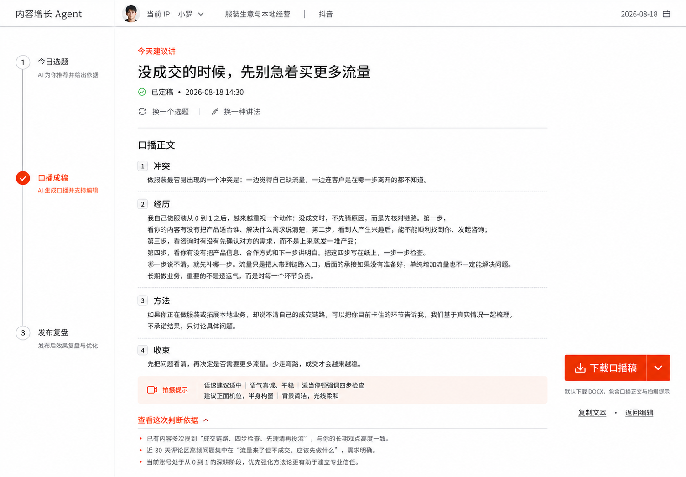
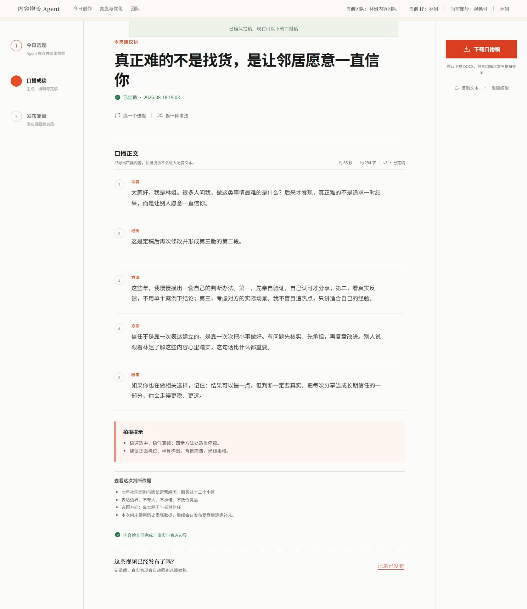

# 今日创作页视觉复核

## Task 8 实施前审计

本轮沿用已确认的“单一创作路径、连续稿纸、结果优先”方向，不调整路由、导航命名、表单字段顺序或业务流程。产品视觉从暖白纸张、衬线标题和朱红主按钮，收敛为冷静可信的 AI 原生工作台：无衬线文字、低饱和中性色、单一蓝色强调、清晰状态与可恢复操作。

| 文件或区域 | 当前问题 | 本轮处理 |
| --- | --- | --- |
| `src/app/globals.css` | 根令牌仍以暖纸色、朱红和衬线字体为主；页面内存在重复颜色、间距、圆角和层级值 | 建立语义化颜色、排版、间距、边框、状态与层级令牌；组件只消费语义令牌 |
| `TenantMasthead`、`WorkspaceContextSwitcher` | 桌面信息偏散，窄屏导航与团队、IP、账号切换缺少统一空间规则 | 保持任务导航和上下文入口，改为清晰的双层窄屏布局；保证键盘开启、Escape 关闭及焦点归还 |
| IP 建档组件 | 旧衬线标题和大面积纸张感削弱了“逐问生成内容画像”的任务反馈；禁用提交缺少原因 | 统一为内容依据驱动的对话式表单，选项点击区不小于 44px，补充禁用原因和错误关联 |
| 今日创作组件 | 已确认信息架构可用，但局部使用独立令牌；判断依据抽屉为手写对话框 | 保留三步路径、连续口播稿和定稿下载主操作；并入全局语义令牌，将抽屉改为原生模态对话框 |
| 复盘组件 | 暖纸与衬线层级过重；导入结果和结论正文竞争；无动作的证据编号伪装成按钮 | 先结论、后证据、再记忆确认；证据编号改为静态引用，导入异常维持可恢复操作 |
| 响应式与自动化验收 | 仅今日创作有移动端截图，缺少 1024 与复盘、建档的统一检查 | 增加 1440×1000、1024×768、390×844 的无横向溢出、键盘、焦点与截图验收 |

实施边界：行业质量门禁仍不进入本轮；不把内部爆款结构库暴露给团长端；不增加装饰性动效、渐变或营销页式大标题。

## Task 1 已确认范围

按 2026-08-18 确认稿落地团长端今日创作页：左侧三步创作路径、中央连续口播稿纸、右侧定稿操作区。定稿后“下载口播稿”为唯一主操作，“复制文本”和“返回编辑”为三级文字操作。

Task 1 当时不包含登录页、IP 建档页和复盘页整体视觉重做；这些页面已在 Task 8 纳入统一视觉与可访问性整改。行业质量门禁仍不在首版范围。

## 同屏对比

<table>
  <tr><th>已确认视觉方向</th><th>真实浏览器实现</th></tr>
  <tr>
    <td></td>
    <td></td>
  </tr>
</table>

移动端实现：`outputs/design-reference/today-draft-mobile.png`。

## 复核结论

- 信息架构一致：今日选题、口播成稿、发布复盘形成单一路径，没有恢复 SaaS 卡片网格。
- 主次一致：下载使用单一蓝色实心按钮；复制仅为低对比度文字操作，不再与下载竞争。
- 稿件结构清晰：正文按冲突、经历、方法、收束分段，拍摄提示与配音正文明确隔离。
- 返回路径完整：锁稿时正文只读；点击“返回编辑”后才恢复分段编辑，保存后可自动检查并重新定稿。
- 响应式可用：桌面端三栏，窄屏转为横向步骤条与底部行动区；`390 × 844` 无页面横向溢出。
- 可访问性：关键操作使用语义化按钮，编辑按钮具备逐段可访问名称，动态结果使用 `aria-live`，焦点态可见。

实现与确认稿的非功能性差异仅来自真实业务数据长度、现有租户导航以及发布回执；未改变已确认的视觉层级。

## Task 8 三视口复核

真实生产构建截图位于 `test-results/design-qa/`：

- 今日创作：`task8-today-desktop.png`、`task8-today-compact.png`、`task8-today-mobile.png`；
- 登录与首次建档：`task8-login-desktop.png`、`task8-onboarding-desktop.png`、`task8-onboarding-compact.png`、`task8-onboarding-mobile.png`；
- 复盘：`task8-review-mobile.png`、`review-memory-implementation.png`、`review-memory-implementation-mobile.png`；
- 生成中、发布回执和记忆回注：`generation-progress.png`、`publication-implementation.png`、`memory-in-creation-implementation.png`。

复核结论：

- 1440×1000、1024×768、390×844 均无页面横向溢出；移动端主要按钮与上下文切换目标不小于 44×44；
- 团队、IP、账号切换保持单一入口；原生模态框支持键盘开启、Escape 关闭、焦点约束与焦点归还；
- IP 建档禁用按钮有可访问原因，复盘错误使用 `alert`，成功/进度使用 `status`；
- 证据编号在没有跳转目标时使用静态引用，不再伪装成可点击按钮；
- 状态均有文字说明，不依赖红绿颜色；页面未引入渐变、装饰动效或 SaaS 卡片墙；
- 视觉已从暖白纸面、衬线大标题和朱红按钮迁移为冷灰白表面、无衬线信息层级和单一蓝色强调，同时保留已审批的连续稿件结构。

`fixing-accessibility` 复核未发现未关闭的 P0/P1：导航、表单、原生对话框、分段编辑、导入与定稿均可使用键盘完成。

## 最终验证证据

- 单元测试：70 个测试文件、333 项测试通过。
- 类型检查：通过。
- Next.js 生产构建：通过。
- Playwright 端到端：15 项通过，覆盖登录、三视口、键盘与焦点、分段编辑、自动检查定稿、DOCX 下载、返回编辑、换选题、首次建档、发布复盘、真实数据记忆回注及权限隔离。
- 浏览器 Console 与页面运行错误：为空。
