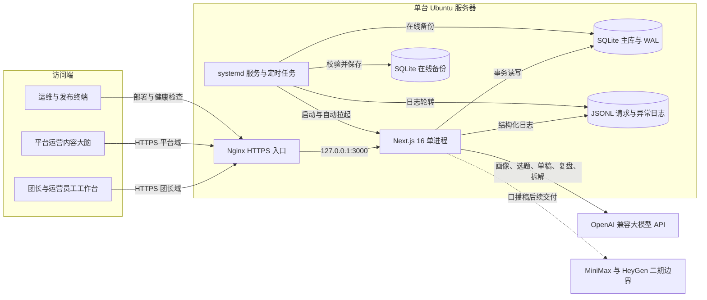
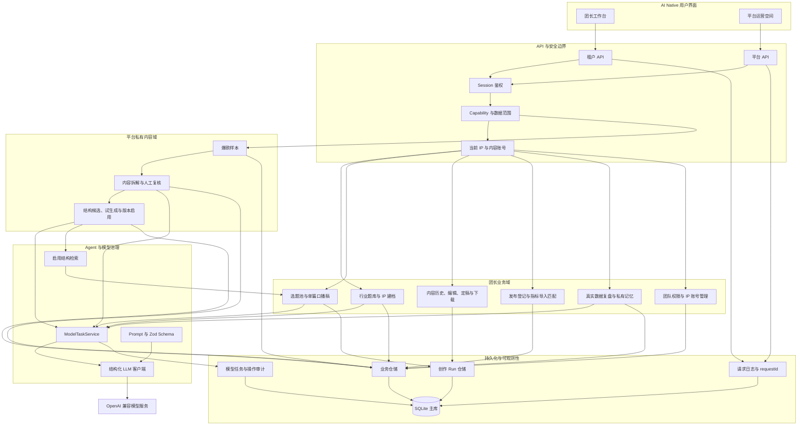

# 团长内容增长 Agent 当前项目完整架构图

> 更新日期：2026-08-27
> 对应数据库 Migration：v19
> 架构形态：单机部署的模块化单体

## 一、部署架构

## 二、应用逻辑架构

## 三、首版核心内容闭环

```mermaid
flowchart LR
    category[选择行业类目] --> questions[动态选择十个以内画像问题]
    questions --> portrait[生成并确认 IP 画像]
    portrait --> topics[生成三至五个选题方向]
    topics --> choose[确定今天拍什么]
    choose --> script[单次请求生成一篇口播稿]
    script --> edit[按结构分段编辑]
    edit --> lock[确认定稿并下载]
    lock --> publish[登记真实发布]
    publish --> import[导入平台表现数据]
    import --> match[匹配已发布文稿]
    match --> review[生成真实数据复盘]
    review --> memory[用户确认私有创作记忆]
    memory --> topics
```

## 四、当前边界

- 首版是模块化单体，不拆微服务；所有模块随一个 Next.js 进程部署。
- 首版没有 Redis、消息队列、多实例和负载均衡。
- 正式模型任务同步执行，但统一经过幂等、并发、额度、超时、取消和审计治理。
- 团长任务按租户隔离；平台爆款拆解使用独立平台作用域。
- 平台爆款样本、拆解证据和结构候选不向团长开放；团长侧只检索已启用结构版本。
- MiniMax 音频和 HeyGen 数字人视频尚未接入，当前交付终点是可编辑、可定稿、可下载的口播稿。
- 二期才考虑负载均衡、异步任务队列、平台数据 API 回流以及数字人视频链路。
