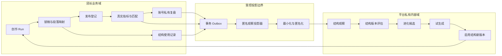

# 爆款结构真实数据复盘与进化模块详细设计

> 文档状态：核心链路已实施，待生产灰度验收
> 编制日期：2026-08-29  
> 对应实施基线：数据库 Migration v24
> 目标版本：首版内容闭环增强，不引入微服务、Redis、外部消息队列或多实例  
> 适用范围：团长域真实发布数据回流，平台运营域爆款结构版本进化

## 一、设计结论

本模块不是“让大模型定时重写模板”，而是建立一条可验证、可追溯、可回退的结构进化闭环：

```text
结构版本 → 真实创作使用 → 锁稿 → 发布 → 指标匹配 → 租户复盘
→ 匿名结构观察 → 结构版本聚合 → Agent 生成进化候选
→ 人工复核 → 试生成 → 管理员启用新版本 → 下一轮创作
```

首版采用以下硬约束：

1. 每篇定稿必须有且只有一个“主结构版本”参与效果归因；辅助结构只保留使用血缘，不计为直接效果证据。
2. 结构版本、结构节点、生成段落、人工编辑、锁稿版本和发布作品必须形成完整不可变血缘。
3. 视频级指标只能评价结构整体表现；没有逐秒留存或时间轴时，不能断言某个具体节点导致流失。
4. 确定性程序负责计算指标、基线、样本量和证据等级；LLM 只解释事实并起草候选，不得生成或修改事实值。
5. 任何进化都产生新版本，不覆盖当前启用版本；旧内容永远绑定其原始结构版本。
6. 真实数据不会直接自动启用结构。首版必须经过平台运营复核、试生成和平台管理员确认。
7. 团长私有画像、完整口播稿、账号名称和原始复盘不得进入平台结构库；平台域只保存最小化、匿名化观察。

## 二、目标与非目标

### 2.1 目标

- 明确每个已启用结构版本被哪些正式口播稿使用。
- 将发布作品的真实指标与准确的锁稿版本、结构版本绑定。
- 使用账号自身历史基线评价结构表现，避免大账号绝对播放量污染判断。
- 聚合结构在不同行业、IP 类型、受众和内容目标中的真实表现。
- 自动发现适用范围、节点指令、质量规则和风险规则的稳定改进机会。
- 生成带证据引用的结构升级候选，并复用现有复核、试生成、启用和回退能力。
- 数据修正、重新匹配、发布停用和重复任务不会造成重复计数或不可恢复状态。

### 2.2 非目标

- 首版不根据单条视频自动修改结构。
- 首版不做跨租户原文检索，不把团长口播稿复制到平台内容大脑。
- 首版不宣称视频级完播率能够精确定位某个中间段落的掉点。
- 首版不做自动 A/B 流量分配、金丝雀结构发布或多臂老虎机算法。
- 首版不建设向量库或图数据库；SQLite 关系表和 JSON 快照足以完成当前数据规模的血缘和聚合。
- 首版不处理外部发布但无法追溯到系统锁稿的作品结构归因。

## 三、当前基础与缺口

### 3.1 已有能力

| 已有能力 | 当前数据或模块 | 可复用方式 |
| --- | --- | --- |
| 创作 Run 锁定结构版本 | `creation_run_context.structure_version_ids_json` | 作为结构使用血缘入口 |
| 不可变选题、文稿和锁稿 | `script_batches`、`script_selections`、`locked_scripts` | 确定发布作品对应的准确文稿版本 |
| 正式发布登记 | `publications` | 将系统锁稿绑定到平台作品身份 |
| 指标导入与匹配 | `real_metric_snapshots`、`publication_match_versions` | 提供真实、可修正的表现证据 |
| 账号基线 | `AccountBaselineService` | 复用中位数、四分位和样本等级计算 |
| 真实数据复盘 | `content_review_versions`、`review_evidence_links` | 复用事实、假设和证据白名单治理 |
| 爆款结构治理 | `platform_template_versions`、`platform_structure_candidates` | 复用不可变版本、试生成、启用、停用和回退 |
| 平台异步 Worker | `agent_jobs` 与内容分析 Worker | 扩展为观察投影、聚合和候选生成任务 |

### 3.2 必须补齐的缺口

1. `structure_version_ids_json` 只能说明 Run 检索过哪些结构，无法区分主结构和辅助结构。
2. 结构节点没有稳定 `nodeKey`，无法跨版本、跨文稿追踪同一个节点。
3. 生成稿段落没有保存“来自哪个结构节点”的可靠映射。
4. 租户复盘完成后，没有生成平台可用的匿名结构观察。
5. 没有按结构版本和使用场景聚合的效果快照。
6. 当前候选只支持“爆款样本拆解来源”，不能表达“真实效果聚合来源”。
7. 没有结构进化任务、证据门槛、失效补偿和运营页面。

## 四、领域边界



边界规则：

- 团长域保存租户、IP、账号、原始文稿、发布身份和真实指标。
- 平台域只保存结构版本、匿名场景桶、相对基线指标、节点编辑信号和证据等级。
- 平台 API 不得返回租户 ID、IP 名称、账号名称、视频标题、完整口播稿或原始复盘正文。
- 从团长域到平台域的投影必须由服务端完成，客户端不能提交“结构效果结论”。
- 是否允许平台使用匿名聚合数据，应由服务协议和产品配置明确；未获得授权时不生成平台观察。
- 场景桶必须来自受控枚举，禁止把用户自由文本直接作为标签；同一场景桶覆盖少于 3 个匿名 IP 时，平台页面只能归入“其他/样本不足”。

## 五、完整数据闭环

### 5.1 Plan：结构选择和创作意图

创建 Run 时，结构检索器可以返回多个结构，但必须明确：

- `primaryStructureVersionId`：唯一主结构，参与效果归因；
- `supportingStructureVersionIds`：辅助结构，只用于补充规则或表达方式；
- `selectionReason`：为什么选择主结构；
- `contextSnapshot`：行业代码、内容目标、受众类型和非敏感 IP 标签快照。

若无法确定主结构，则 Run 标记为 `unattributed`，后续仍可发布和复盘，但不进入结构效果聚合。

### 5.2 Do：生成、编辑和锁稿

结构 v2 节点必须使用稳定标识：

```json
{
  "nodeKey": "hook_conflict",
  "kind": "冲突开场",
  "instruction": "使用可核验的真实冲突切入",
  "required": true
}
```

生成文稿时，每个结构化段落保存：

```json
{
  "segmentId": "seg-01",
  "heading": "冲突开场",
  "spokenText": "……",
  "origin": "structure_node",
  "sourceTemplateVersionId": "template-version-id",
  "sourceNodeKey": "hook_conflict"
}
```

人工编辑时保持 `segmentId` 不变：

- 修改原段落：记录 `edited` 和生成/锁稿内容哈希；
- 删除原段落：记录 `removed`；
- 新增段落：记录 `user_added`，不伪造结构节点来源；
- 合并或拆分段落：保存源 `segmentId` 列表。

锁稿事务同时写入锁稿版本、结构使用记录、节点映射和 Outbox 事件。任意一步失败，整笔事务回滚。

### 5.3 Check：发布、指标与复盘

只有满足以下条件的作品可以形成结构观察：

1. `publications.source='system'`；
2. 发布记录绑定准确的 `run_id + locked_script_version + locked_script_selection_version`；
3. 当前匹配版本为 `matched`；
4. 指标快照 `is_simulated=0`；
5. 发布状态为 `active`；
6. Run 存在唯一主结构版本；
7. 对应结构使用记录完整。

指标导入或匹配确认后，Outbox 生成 `structure.observation.refresh_requested`。投影器读取同账号历史基线，计算相对表现并写入匿名观察。

### 5.4 Act：评估、候选和启用

当结构版本的有效观察集合发生变化时：

1. 生成确定性评估快照；
2. 根据样本量和覆盖范围计算证据等级；
3. 达到候选门槛时，结构进化 Agent 读取评估事实；
4. Agent 输出结构化修改建议和证据引用；
5. 服务端校验证据白名单、字段边界和修改范围；
6. 保存为标准结构候选；
7. 平台运营编辑、复核并试生成；
8. 平台管理员填写原因并启用新版本；
9. 新 Run 才检索新版本，历史 Run 继续绑定旧版本。

## 六、归因和证据规则

### 6.1 主结构归因

一篇内容只能有一个主结构。辅助结构不参与直接效果统计，原因是同一结果不能被无差别计入多个结构版本。

| 情况 | 版本级归因 | 节点级归因 |
| --- | --- | --- |
| 唯一主结构且节点映射完整 | 允许 | 允许生成受限观察 |
| 唯一主结构但节点映射缺失 | 允许 | 禁止 |
| 多个结构但无主次 | 禁止 | 禁止 |
| 外部作品没有系统锁稿 | 禁止 | 禁止 |
| 指标未匹配或仍为候选 | 禁止 | 禁止 |

### 6.2 视频级与节点级证据

| 数据 | 可以支持 | 不能支持 |
| --- | --- | --- |
| 播放、互动、完播率 | 结构整体与同账号基线的相关表现 | 单个节点的因果结论 |
| 3 秒、5 秒留存 | 开场节点的受限相关观察 | 证明具体一句话导致留存变化 |
| 平均观看时长、完播率 | 主体和结尾的整体观看深度 | 定位具体掉点 |
| 逐秒留存 + 成片字幕时间轴 | 对齐到节点时间范围的掉点观察 | 在样本不足时证明稳定因果 |
| 用户编辑、删除和保留 | 节点可用性、可拍性和表达匹配度 | 真实观众表现 |
| 人工复盘确认 | 将假设升级为人工确认信号 | 替代真实指标 |

首版没有逐秒留存和成片时间轴时，节点信号只能标记为 `node_hypothesis`。界面必须显示“相关观察”或“待验证”，不能显示“导致”“提升了”等因果措辞。

### 6.3 账号基线

优先复用 `AccountBaselineService`：

- 取同一租户、IP、内容账号和平台的当前有效匹配；
- 每个作品只取最新真实快照；
- 使用中位数作为基线，四分位区间表达稳定范围；
- 0～2 条为 `facts_only`；
- 3～4 条为 `tentative`；
- 5 条及以上为 `memory_eligible`。

结构观察只保存与基线比较后的结果，不复制原始账号数据。率类指标：

```text
绝对差 = 当前率 - 账号基线中位数
相对差 = 绝对差 / max(账号基线中位数, 0.0001)
```

计数类指标先转换为每千次播放率；播放量本身只作为覆盖量和置信度参考，不作为结构质量结论。

### 6.4 结构进化门槛

| 等级 | 默认条件 | 系统行为 |
| --- | --- | --- |
| 单条事实 | 1～2 个有效作品 | 记录观察，不生成结论 |
| 探索观察 | 3～4 个有效作品 | 展示趋势，允许人工标记待观察 |
| 初步候选 | ≥5 个有效作品且 ≥2 个匿名 IP | Agent 可生成候选，但标记“证据有限” |
| 标准候选 | ≥10 个有效作品且 ≥3 个匿名 IP | 可进入正常复核、试生成和启用 |

效果候选门槛只统计具有可用账号基线的 `tentative/confirmed` 观察；只有单条绝对数据的 `fact` 可以展示和留档，但不能用于宣称相对提升。节点编辑率等产品内行为信号单独计数，不能替代观众表现数据。

以下情况不受效果门槛限制，但仍需人工复核：合规规则修正、风险边界补充和明确错误修复。管理员强制越过效果门槛时必须填写原因，并写入审计日志；界面不得将其描述为“数据验证有效”。

## 七、进化类型

Agent 每次只能选择一个主变更类型，避免一次候选同时重写所有内容：

| 类型 | 适用条件 | 输出 |
| --- | --- | --- |
| `applicability_adjustment` | 结构只在部分场景稳定 | 调整 IP 标签、受众或内容目标 |
| `node_instruction_update` | 某节点编辑率高或相关表现长期不稳定 | 修改节点指令，不改变整体结构 |
| `quality_rule_update` | 多次复盘出现同类可用性问题 | 新增或调整质量规则 |
| `risk_rule_update` | 出现合规、事实或承诺风险 | 新增或调整风险规则 |
| `variant_create` | 不同场景出现稳定相反表现 | 从当前版本创建明确适用范围的分支 |
| `no_change` | 证据不足或当前版本稳定 | 保持版本，不制造候选 |

禁止 Agent：

- 删除所有风险规则；
- 扩大适用范围却不给证据；
- 引用评估白名单之外的观察；
- 把租户原文、账号名称或单个 IP 信息写入候选；
- 在一个候选中改变模板身份、多个核心节点和全部规则。

## 八、状态机

### 8.1 结构使用记录

```text
captured → attributable → observed
    └────────→ unattributed
observed → invalidated → observed（修正后重新投影）
```

- `captured`：锁稿时已保存使用快照；
- `attributable`：主结构和节点映射满足归因条件；
- `observed`：已有有效发布指标投影；
- `unattributed`：无法可靠归因，只保留血缘；
- `invalidated`：发布停用、匹配修正或证据失效。

### 8.2 结构评估

```text
building → current → superseded
        └→ failed → building
```

同一结构版本同一输入集合只能有一个评估；输入观察变化时创建新评估版本并将旧版本标记为 `superseded`。

### 8.3 进化候选

```text
draft → review_required → preview_required → activation_required → active
  ├──────────────→ rejected
  └──────────────→ superseded
```

候选进入 `active` 后只读；不得再次出现保存、驳回或启用操作。修改已启用结构必须创建新候选版本。

## 九、数据模型

### 9.1 结构节点 Schema v2

`platform_template_versions.payload_json` 中每个节点新增：

| 字段 | 类型 | 说明 |
| --- | --- | --- |
| `nodeKey` | string | 模板内稳定且唯一，跨小版本保持不变 |
| `kind` | string | 运营展示名称 |
| `instruction` | string | 生成指令 |
| `required` | boolean | 是否必须覆盖 |

旧版本读取时按 `legacy:{kind}:{index}` 派生兼容键，但新写入版本必须显式包含 `nodeKey`。

### 9.2 `structure_usage_records`

租户域表，每个锁稿版本与结构版本一条记录。

| 字段 | 约束或说明 |
| --- | --- |
| `id` | UUID 主键 |
| `tenant_id`、`ip_profile_id`、`content_account_id` | 租户范围，外键 |
| `run_id` | 创作 Run |
| `locked_script_version` | 不可变锁稿版本 |
| `locked_script_selection_version` | 锁定的文稿选择版本 |
| `template_id`、`template_version_id` | 结构身份和准确版本 |
| `role` | `primary` 或 `supporting` |
| `context_json` | 行业代码、内容目标、受众类型、非敏感标签快照 |
| `status` | `captured/attributable/observed/unattributed/invalidated` |
| `created_at`、`updated_at` | 审计时间 |

唯一约束：`(run_id, locked_script_version, template_version_id)`。  
部分唯一索引：同一 `run_id + locked_script_version` 只能存在一个 `role='primary'`。

### 9.3 `structure_usage_nodes`

| 字段 | 说明 |
| --- | --- |
| `usage_id` | 关联 `structure_usage_records` |
| `node_key` | 稳定节点标识 |
| `node_order` | 结构顺序 |
| `segment_refs_json` | 锁稿段落 ID 列表 |
| `generated_hash`、`locked_hash` | 判断人工修改，不保存重复正文 |
| `edit_state` | `unchanged/edited/removed/merged/unmapped` |
| `mapping_confidence` | `exact/derived/unmapped` |

主键：`(usage_id, node_key)`。

### 9.4 `domain_outbox`

在业务事务内保存需要异步投影的事件。

| 字段 | 说明 |
| --- | --- |
| `id` | UUID |
| `event_type` | `structure.usage.captured`、`structure.observation.refresh_requested` 等 |
| `aggregate_type`、`aggregate_id` | 业务对象 |
| `dedupe_key` | 全局唯一幂等键 |
| `payload_json` | 只保存引用 ID，不放完整正文 |
| `status` | `pending/processing/completed/failed/dead_letter` |
| `attempt_count`、`available_at`、`last_error_code` | 重试治理 |
| `created_at`、`updated_at` | 审计时间 |

Worker 使用租约领取；进程崩溃后超时任务可重新领取。相同 `dedupe_key` 只处理一次。

### 9.5 `platform_structure_observations`

平台域匿名观察表。

| 字段 | 说明 |
| --- | --- |
| `id` | UUID |
| `template_id`、`template_version_id` | 被观察结构版本 |
| `evidence_hash` | 发布、快照、结构版本组合的不可逆哈希，唯一 |
| `scope_fingerprint` | IP/账号作用域 HMAC，只用于去重计数 |
| `context_bucket_json` | 行业、受众、内容目标的受控枚举桶 |
| `metric_delta_json` | 与账号基线的绝对差、相对差、缺失字段 |
| `node_signals_json` | 编辑、删除和受限指标信号 |
| `evidence_tier` | `fact/tentative/confirmed/manual` |
| `source_captured_at` | 原证据时间 |
| `status` | `active/superseded/invalidated` |
| `created_at`、`updated_at` | 审计时间 |

该表禁止出现租户 ID、IP 名称、账号名称、标题、原始口播稿和完整复盘。

另建内部表 `structure_observation_source_links`，保存 `observation_id + usage_id + publication_id + snapshot_id + review_id`。该表用于失效补偿和受控审计，不属于平台 API 读取模型；只有服务端投影器和管理员修复任务可以访问。这样既能保持端到端可追溯，又不会把租户原始身份投影到平台运营页面。

### 9.6 `platform_structure_evaluations`

| 字段 | 说明 |
| --- | --- |
| `id` | UUID |
| `template_id`、`template_version_id` | 评估对象 |
| `version` | 评估版本 |
| `input_hash` | 排序后的有效观察集合哈希，唯一幂等 |
| `window_start`、`window_end` | 证据窗口 |
| `publication_count` | 有效作品数 |
| `scope_count` | 匿名 IP 数 |
| `aggregate_json` | 各指标分布、场景桶、节点信号和缺失项 |
| `confidence` | `facts_only/exploratory/standard` |
| `algorithm_version`、`policy_version` | 固化计算规则和证据门槛版本 |
| `status` | `building/current/superseded/failed` |
| `created_at` | 创建时间 |

另建 `platform_structure_evaluation_evidence(evaluation_id, observation_id)`，避免只在 JSON 中保存血缘。

### 9.7 泛化 `platform_structure_candidates`

当前表要求 `sample_id NOT NULL`，只能表达样本拆解候选。实施时使用版本化 Migration 重建表：

- `sample_id` 改为可空；
- 新增 `source_type`：`sample_breakdown/outcome_evolution`；
- 新增 `source_reference_id`；
- 新增 `base_template_version_id`；
- 新增 `change_type`；
- 新增 `generated_by_model_task_id`，保留生成模型、Prompt、Token 和 requestId 血缘；
- 新增检查约束：样本来源必须有 `sample_id`，进化来源必须有关联评估；
- 旧数据回填 `source_type='sample_breakdown'`。

新增 `platform_candidate_evaluation_links(candidate_id, evaluation_id)`。试生成、启用事件和版本治理继续复用现有表，不创建第二套启用流程。

## 十、服务与模块职责

首版保持模块化单体，只增加三个业务服务和一个通用投影机制。

### 10.1 `StructureUsageService`

- 在锁稿事务中确定唯一主结构；
- 校验模板版本真实存在且当时可用；
- 固化场景快照和节点到段落的映射；
- 计算节点编辑状态和内容哈希；
- 写入使用记录和 Outbox；
- 不读取真实表现数据，不调用 LLM。

### 10.2 `StructureObservationProjector`

- 响应发布匹配、指标更新、匹配修正和发布停用事件；
- 校验作品是否满足归因条件；
- 调用账号基线服务计算相对表现；
- 生成匿名场景桶和 HMAC 指纹；
- 幂等写入或失效平台观察；
- 不生成自然语言结论，不修改结构版本。

### 10.3 `StructureEvaluationService`

- 查询结构版本当前有效观察；
- 确定性计算样本量、覆盖数、中位数、四分位和场景差异；
- 计算证据等级和候选门槛；
- 创建不可变评估版本与证据链接；
- 输入未变化时直接返回已有评估。

### 10.4 `StructureEvolutionService`

- 仅在评估达到门槛或管理员以合规原因触发时调用 LLM；
- 使用评估事实白名单和当前模板版本；
- 通过 Zod 校验进化输出；
- 拒绝白名单外证据、扩大范围无依据和敏感字段；
- 创建统一结构候选；
- 之后复用现有编辑、试生成、启用和回退服务。

### 10.5 Worker

现有 Worker 不增加常驻进程，按两层处理：

1. Outbox 分发器以租约方式读取事件，执行确定性的观察投影和评估刷新；
2. 需要调用模型时，以唯一幂等键创建 `agent_jobs`，再由现有任务执行器运行进化候选任务。

`agent_jobs` 的 CHECK 约束通过 Migration 扩展为：

- `structure_observation_projection`；
- `structure_evaluation`；
- `structure_evolution_proposal`。

不同任务共用统一的排队、心跳、超时、重试、取消、错误码和运行日志，不拆成多个常驻进程。

## 十一、AI 输入输出契约

### 11.1 输入

LLM 只能接收：

- 当前结构版本的完整平台模板；
- 评估 ID 和证据等级；
- 匿名场景桶；
- 聚合指标差异和缺失字段；
- 节点编辑、删除和假设信号；
- 允许引用的观察 ID 白名单；
- 平台质量与风险边界。

不得接收租户名称、账号名称、视频标题、完整口播稿、原始 IP 画像和用户身份。

### 11.2 输出 Schema

```json
{
  "decision": "upgrade_existing",
  "changeType": "node_instruction_update",
  "targetTemplateId": "template-id",
  "baseTemplateVersionId": "template-version-id",
  "summary": "为什么需要或不需要进化",
  "evidenceRefs": ["observation-id"],
  "evidenceLimits": "当前证据不能证明什么",
  "proposedTemplate": {
    "name": "结构名称",
    "applicability": {},
    "nodes": [],
    "qualityRules": [],
    "riskRules": []
  },
  "confidence": "exploratory"
}
```

服务端再次校验：

- `evidenceRefs` 全部来自白名单；
- `baseTemplateVersionId` 与任务输入一致；
- `nodeKey` 唯一且未擅自替换模板身份；
- 风险规则没有被无依据删除；
- 修改数量未超过单候选限制；
- 证据不足时不能输出 `standard`。

## 十二、接口设计

所有新接口属于平台域，团长端不新增平台结构数据读取权限。

| 方法与路径 | 用途 | 权限 |
| --- | --- | --- |
| `GET /api/platform/content-brain/structures/{versionId}/performance` | 查看结构版本真实表现文档 | `platform_operator` |
| `POST /api/platform/content-brain/structures/{versionId}/evaluate` | 幂等创建或读取当前评估 | `platform_operator` + `Idempotency-Key` |
| `GET /api/platform/content-brain/evolution-tasks` | 查看需要关注的结构任务 | `platform_operator` |
| `POST /api/platform/content-brain/evaluations/{id}/propose` | 生成进化候选 | `platform_operator` + `Idempotency-Key` |
| `GET /api/platform/content-brain/evaluations/{id}/evidence` | 查看匿名证据摘要 | `platform_operator` |
| `POST /api/platform/content-brain/observations/reproject` | 修复投影，仅接受精确资源 ID | `platform_admin` |

候选编辑、试生成、启用、停用和回退继续使用当前接口。所有模型入口继续经过 `ModelTaskService`，使用平台作用域额度和请求追踪。

## 十三、AI Native 运营界面

### 13.1 结构库首页

不增加传统指标看板。每个启用结构只显示一段可行动摘要：

```text
真实冲突到责任原则 · v2
12 条有效作品 · 4 个匿名 IP · 标准证据

稳定表现
开场 5 秒留存相对账号基线中位数 +14%

需要处理
“价值收束”节点编辑率 46%，在健康管理类内容中表现不稳定

Agent 建议
保留整体结构，为价值收束建立一个更克制的行业变体

[查看证据] [生成升级候选]
```

证据不足时明确显示“继续积累”，不展示伪精确百分比结论。

### 13.2 待进化任务

系统主动生成任务，而不是要求运营人员自己筛指标：

- 为什么现在出现该任务；
- 证据等级和缺失项；
- Agent 推荐的唯一下一动作；
- `查看证据`、`暂不处理`、`生成候选`。

“暂不处理”必须记录原因和下次重新提醒条件。

### 13.3 候选详情

候选文档依次展示：

1. 当前版本和建议版本对比；
2. 变更类型和适用范围；
3. 每项修改对应的匿名证据；
4. 证据不能证明的内容；
5. 试生成口播稿；
6. 质量和风险检查；
7. 启用原因和回退点。

候选启用后进入只读档案，不再显示保存、驳回、再次试生成和再次启用操作。

## 十四、一致性、幂等与补偿

### 14.1 事务边界

- 锁稿 + 使用记录 + 节点映射 + Outbox：同一事务。
- 指标匹配版本切换 + 刷新 Outbox：同一事务。
- 观察写入/失效 + 评估刷新 Outbox：同一事务。
- 候选启用 + 模板新版本 + 激活事件：沿用当前原子事务。

### 14.2 幂等键

| 操作 | 幂等依据 |
| --- | --- |
| 捕获结构使用 | `run + lockedVersion + templateVersion` |
| 生成观察 | `publication + snapshot + templateVersion` 的哈希 |
| 生成评估 | 排序后的有效观察 ID 集合哈希 |
| 生成候选 | `evaluationId + baseTemplateVersionId + proposalHash` |
| 启用候选 | 当前候选 ID + 版本，复用现有启用事件 |

### 14.3 数据修正

- 新快照到达：旧观察 `superseded`，新观察参与新评估。
- 当前匹配被人工修正：原匹配观察 `invalidated`，新匹配重新投影。
- 发布被停用：相关观察失效并重算评估。
- 复盘从 generated 变为 superseded：仅依赖该复盘人工确认信号的观察失效，真实指标观察保留。
- 结构停用或回滚：不删除历史观察；新 Run 只使用当前活动版本。
- Worker 中断：租约超时后重试；达到最大次数进入 `dead_letter` 并告警。

所有补偿都通过新状态和新版本完成，不物理删除证据，不手工覆盖历史快照。

## 十五、权限、隐私与审计

- 团长成员只能查看自己租户的创作、发布、指标和复盘。
- 平台运营只能查看匿名结构观察和聚合评估。
- 平台管理员才可以强制重投影、越过效果门槛、启用、停用和回退。
- HMAC 指纹使用独立服务密钥，平台 API 不返回指纹原值。
- 新增 `ENABLE_STRUCTURE_OUTCOME_LEARNING` 和 `STRUCTURE_LEARNING_HMAC_KEY`；功能关闭时不投影，功能开启但密钥缺失时生产环境拒绝启动。
- 证据页面只展示按周归档的时间、场景桶和相对指标区间，不展示可反查到单个账号的精确发布时间和绝对数据。
- 日志只记录任务 ID、结构版本 ID、评估 ID、状态、耗时和稳定错误码。
- 日志不得记录原始指标文件、完整口播稿、租户标识映射和 LLM 输入全文。
- 强制门槛越过、观察失效、候选驳回、启用和回退必须写 `audit_logs`。

## 十六、可观测性与运行指标

至少记录：

- Outbox 待处理数、最老事件等待时间；
- 观察投影成功、跳过、失效和失败数量；
- 无法归因的锁稿比例及原因；
- 结构评估输入观察数和计算耗时；
- 候选生成模型耗时、Token、修复次数和失败码；
- 从指标匹配确认到平台观察可见的延迟；
- 从达到门槛到运营处理的等待时间；
- 新版本启用后新增使用量和回退次数。

首版目标：

- 指标匹配确认后 5 分钟内生成或刷新结构观察；
- 同一证据重复处理 10 次仍只有一条当前有效观察；
- Worker 重启不会丢失已提交业务事务对应的事件；
- 任一观察可追溯到使用记录、锁稿版本、发布、快照和评估，但平台页面不泄露租户原始数据。

## 十七、失败场景

| 场景 | 处理 |
| --- | --- |
| Run 使用多个结构但没有主结构 | 标记 `unattributed`，不计入效果 |
| 锁稿缺少节点映射 | 允许版本级观察，禁用节点级结论 |
| 外部发布无法绑定系统锁稿 | 只进入租户复盘，不进入结构进化 |
| 指标字段缺失 | 保存缺失清单，只计算有证据指标 |
| 账号历史不足 | `facts_only`，不计算相对提升结论 |
| 匹配后来被修正 | 原观察失效，新观察和评估重建 |
| LLM 引用不存在证据 | 拒绝候选并记录 `EVIDENCE_REFERENCE_INVALID` |
| LLM 返回结构不完整 | 共享总超时预算修复一次，仍失败则任务可重试 |
| 候选基于过期评估 | 返回 409，要求基于当前评估重新生成 |
| 启用事务失败 | 当前结构版本保持不变，候选仍可重试 |

## 十八、实施顺序

### 阶段一：结构使用血缘

- 为模板节点增加 `nodeKey` 和兼容读取。
- 创作结果增加主结构、辅助结构和段落来源。
- 锁稿时保存 `structure_usage_records` 与 `structure_usage_nodes`。
- 补齐单元测试、迁移测试和历史结构兼容测试。

完成标准：任一系统锁稿都能回答“使用了哪个主结构版本、哪些节点生成了哪些段落、用户改了什么”。

### 阶段二：可靠投影

- 新增 `domain_outbox`。
- 扩展 Worker 任务类型和租约治理。
- 实现匿名结构观察和数据修正补偿。
- 接入指标匹配、快照更新和发布停用事件。

完成标准：真实指标确认后自动形成唯一匿名观察，重复处理和服务重启不重复计数。

### 阶段三：结构评估与进化候选

- 新增评估、证据链接和门槛判断。
- 泛化现有候选来源。
- 实现结构进化 Prompt、Schema 和证据白名单校验。
- 复用试生成、启用、停用和回退。

完成标准：达到门槛的结构能生成一条可解释候选，且每项修改都有有效证据引用。

### 阶段四：运营界面与全链路验收

- 结构库增加真实表现摘要。
- 增加待进化任务和证据文档。
- 候选详情增加版本对比、证据限制和启用回退点。
- 完成生产迁移、备份、部署和回退验证。

完成标准：平台运营不需要查数据库即可完成“发现问题—生成候选—试生成—启用新版本”。

## 十九、端到端验收用例

必须自动化验证以下主路径：

1. 平台启用结构 v1。
2. 团长新建 Run，系统选择 v1 为唯一主结构。
3. 模型按节点生成结构化口播稿。
4. 用户修改一个节点、删除一个节点并新增一段后锁稿。
5. 锁稿事务保存使用记录、节点映射和 Outbox。
6. 用户登记发布并导入真实指标。
7. 系统准确匹配发布作品并生成租户复盘。
8. Worker 生成匿名结构观察；重复投递不重复计数。
9. 达到门槛后创建结构评估和进化任务。
10. Agent 基于白名单证据生成 v2 候选。
11. 平台运营修改候选并完成试生成。
12. 平台管理员启用 v2，v1 变为 inactive。
13. 新 Run 使用 v2，历史 Run、发布和观察仍绑定 v1。
14. 回滚到 v1 后，新 Run 恢复使用 v1，v2 历史证据不丢失。

还必须验证：

- 指标快照更新后旧观察失效；
- 发布匹配修正后不重复计算；
- 外部作品不进入结构归因；
- 平台接口看不到租户原文和身份；
- 证据不足时不产生强结论；
- 活动候选详情为只读且无重复启用、驳回按钮；
- 生产 Migration 可从 v21 原库升级且可使用部署前备份回退。

## 二十、上线门槛

满足以下条件后才能在生产启用结构进化：

- 数据库 Migration、历史结构兼容和恢复测试通过；
- 主路径与失败补偿集成测试通过；
- 平台域隐私字段自动化测试通过；
- Outbox 重复、重启和死信测试通过；
- Agent 证据白名单、结构 Schema 修复和超时测试通过；
- 现有团长创作、发布、指标、复盘和平台爆款拆解回归测试全部通过；
- 功能开关默认关闭，完成一次生产数据只读回放后再开启观察投影；
- 首次上线只生成观察和评估，不自动生成候选；运营确认数据正确后再开启候选生成。

## 二十一、最终闭环判定

只有同时满足以下四点，才算完成结构数据闭环：

1. **可追溯**：结构版本能够追溯到锁稿、发布、指标、复盘和评估。
2. **不误判**：多结构、外部作品、缺失指标和无时间轴场景不会被包装成节点因果。
3. **可进化**：真实聚合证据能生成统一候选并进入现有试生成和启用流程。
4. **可回退**：新版本不覆盖旧版本，历史内容不漂移，启用失败或效果下降可以恢复稳定版本。

该模块完成后，系统形成两条相互隔离但可闭环协作的学习链路：

- 团长私有链路：真实复盘 → 私有记忆 → 下一轮选题与口播稿；
- 平台结构链路：匿名效果观察 → 结构评估 → 爆款结构新版本 → 后续创作。

两条链路共享真实发布事实和准确版本血缘，但不共享团长原始内容和私有画像。

## 二十二、实施结果与灰度开关

截至 2026-08-29，以下核心链路已落地：

- Migration v22：主结构、辅助结构、节点和稿件段落血缘；
- Migration v23：事务 Outbox、匿名结构观察、修正与停用补偿；
- Migration v24：确定性评估快照、证据链接、效果来源候选；
- 平台“结构进化”工作台：证据等级、指标中位数、节点覆盖、匿名观察和结论边界；
- 候选复用既有人工编辑、试生成、管理员启用和版本回退流程；
- 生产构建、Migration、权限、隐私和核心交互自动化测试。

生产环境必须配置独立的 `STRUCTURE_OBSERVATION_HASH_SALT`，长度不少于 32 个字符。它只用于生成不可逆匿名指纹，不得与登录密码、Session Secret 或模型密钥共用。

`STRUCTURE_EVOLUTION_CANDIDATES_ENABLED` 默认保持 `false`。此时系统继续生成匿名观察和确定性评估，运营端可查看证据，但不能调用模型生成改进候选。完成生产数据只读复核后再设为 `true`；关闭开关不会删除既有观察、评估或已经进入人工复核的候选。
